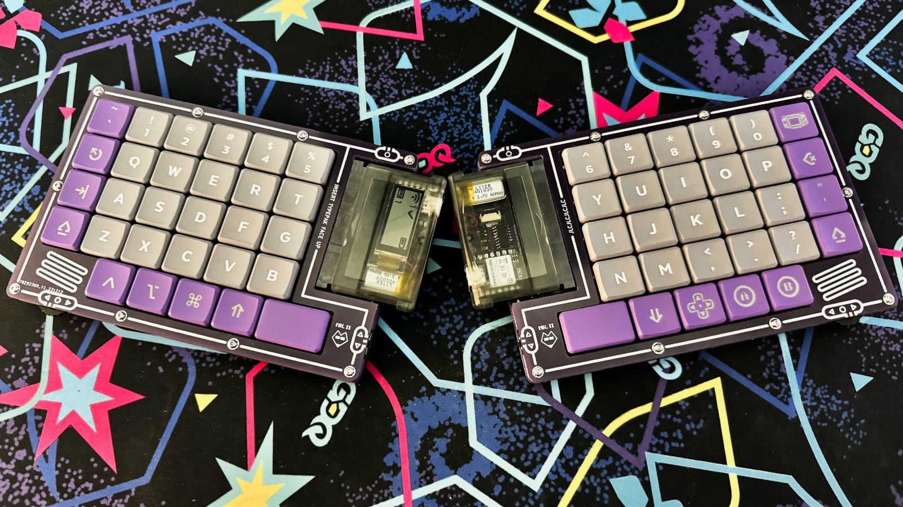

# The TypeBoy Mk II

The Mark II is an updated design to the original TypeBoy keyboard. It continues to leverage the "TypePak" catridge to house the keyboard's microcontroller and other support circuitry. This revision of the TypeBoy uses a more traditional ortholinear keyboard layout, and replaces the previous 3D printed design with a PCB sandwich approach. For more information on the keyboard's background, please feel free to check out this companying blog post.

## Primary Features

* TypeBoy Catridge Support (Integrated XAIO BLE, LiPo Battery, Shift Register, and Sharp Memory Display)
* 6x4+5 ortholinear layout with a staggered modifier row and enlarged space keys.
* Choc v1 switches with Choc spacing.
* SIQ-02FVS3 thumb wheel encoders (with pushbutton support).
* PCB sandwich design.
* ZMK support.

## Ergogen Outputs

The TypeBoy Mk II was designed once again using the [Ergogen](https://github.com/ergogen/ergogen) keyboard layout generator. In this instance, Ergogen was used to create the PCB outputs for the top, middle, and bottom layers of the keyboard. The silkscreen designs were created in Figma and imported directly into the KiCAD outputs. The final routing for the middle layer was also performed in KiCAD.

## Additional Footprints

Ergogen v4 supports custom footprints! The TypeBoy colors outsides the lines and includes a few not included in the standard repo:

* buttonrightangle.js - A right angle pushbutton.
* gbareversible.js - A reversible game boy cartridge slot footprint based off of [Martin Refseth's KiCAD footprint](https://github.com/HDR/Game-Boy-KiCad-Library/blob/master/Footprints/DSL_Cartridge_Reader.kicad_mod).
* lowproro.js - A footprint for the SIQ-02FVS3 low profile rotary encoder. Used in an earlier TypeBoy design.
* mountinghole_m3.js - An M3 mounting hole footprint.
* spdt.js - A right angle power switch.

## Build of Materials

| Part                             | Amount         | Price       | Link |
| -------------------------------- | -------------- | ----------- | ---- |
| TypeBoy Mk II PCBs Via JLCPCB    | 3 (5 PCB Packs) | $45.00 USD (Incl. Shipping) | https://jlcpcb.com |
| Game Boy Cartridge Slot          | 2              | $5.00 USD  | https://www.aliexpress.us/item/2255800103876564.html |
| SIQ-02FVS3 Thumb Wheel           | 2              | $6.00 USD   | https://www.aliexpress.us/item/3256804405904721.html |
| Right Angle Pushbutton           | 2              | $1.00 USD   | https://www.mouser.com/ProductDetail/642-MJTP1117 |
| Right Angle Switch               | 2              | $1.50 USD   | https://www.mouser.com/ProductDetail/612-EG1213 |
| Choc Hotswap Sockets             | 58             | $12.00 USD  | https://www.aliexpress.us/item/3256803687338432.html |
| 1N4148 T4 Diodes                 | 58             | $3.00 USD   | https://www.aliexpress.us/item/2255800498728983.html |
| Choc Switches                    | 58             | $28.00 USD  | https://www.aliexpress.us/item/3256805260407528.html |
| Choc Keycaps                     | Alphas + Mods  | $~60.00 USD | https://mkultra.click/mbk-legend-keycaps/ |
| 3D Printed Case                  | A Few mm of Filament | Varies | https://github.com/ImStuBTW/typeboy_mkii/ |
| 12mm M3 Screws                   | 18             | $2.00 USD   | https://www.aliexpress.us/item/3256803547633472.html |
| M3 Washers                       | 54             | $10.00 USD  | https://www.aliexpress.us/item/3256804700714045.html |
| M3 Nuts                          | 18             | $5.00 USD   | https://www.aliexpress.us/item/2255800148575548.html |
| Bumpons                          | 1 Pack         | $10.00 USD | https://www.amazon.com/Adhesive-Bumper-106-PC-Spherical-Square/dp/B06XPCLN23/ |